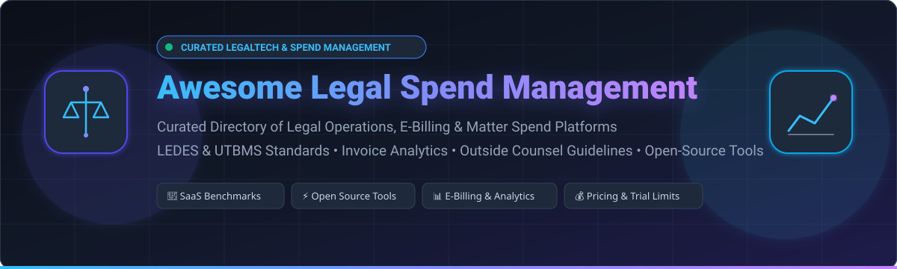

# ⚖️ Awesome Legal Spend Management

### Curated Ecosystem of Enterprise Legal Management (ELM), E-Billing, and Legal Operations Platforms

  
  
  
  
  
  
  

  <b>A comprehensive directory of SaaS software, AI-powered invoice review solutions, and open-source tools for managing outside counsel legal spend, LEDES/UTBMS e-billing standards, and legal operations analytics.</b>

---

## 📌 Table of Contents

- [🔍 Overview](#-overview)
- [🏢 SaaS & Hosted Platforms](#-saashosted-platforms)
  - [Market Size & Structure](#-market-size--industry-dynamics)
  - [SaaS Comparison Matrix](#-enterprise-saas-platforms)
- [⚡ Open-Source GitHub Projects](#-open-source-github-projects)
- [🛠️ Key Standards & Technical Frameworks](#-key-standards--technical-frameworks)
- [🤝 How to Contribute](#-how-to-contribute)
- [📈 Star History](#-star-history)
- [⚠️ Disclaimer](#-disclaimer)

---

## 🔍 Overview

**Legal Spend Management** (a foundational pillar of *Enterprise Legal Management / ELM*) empowers General Counsel (GC) and Legal Operations teams to gain transparency and financial discipline over outside counsel fees, vendor billing, and matter budgets.

Key functional capabilities include:
- 📑 **LEDES / UTBMS E-Billing Parsing**: Automated ingestion of LEDES 1998B, 1998BI, XML 2.0, and 2.1 invoice formats.
- 🤖 **AI Invoice Line-Item Review**: Machine learning enforcement of Outside Counsel Guidelines (OCGs) to detect unauthorized rate hikes, block billing, duplicate entries, and non-compensable clerical tasks.
- 🎯 **Matter-Level Budgeting & Accruals**: Tracking WIP (Work In Progress), unbilled accruals, and Alternative Fee Arrangements (AFAs) against real-time matter targets.
- 📊 **Vendor & Rate Benchmarking**: Comparing blended hourly rates and law firm performance metrics across practices and jurisdictions.

---

## 🏢 SaaS/Hosted Platforms

### 📊 Market Size & Industry Dynamics

> 💡 **Market Sizing & Industry Structure**: The global **Enterprise Legal Management (ELM) & Legal Spend Management market** is valued at **~$5.06 Billion in 2025** and projected to exceed **$12.0+ Billion by 2035** (growing at a CAGR of ~9.1%). The sector is **moderately fragmented** with high consolidation activity led by private equity roll-ups (such as Onit and Mitratech acquisitions) alongside large enterprise legacy providers (Thomson Reuters). Rather than a single winner-take-all monopoly, the market supports a mix of broad enterprise suites and specialized AI-first point solutions that integrate directly with enterprise ERPs (SAP, Oracle, Workday).

### 🚀 Enterprise SaaS Platforms

*Sorted by company scale (market capitalization / valuation / annual revenue) in descending order:*

| Platform | Company Scale (Valuation / Revenue) | Focus & Capabilities | Starting Pricing | Free Tier / Free Trial Limits |
| :--- | :--- | :--- | :--- | :--- |
| **[Thomson Reuters Legal Tracker](https://legal.thomsonreuters.com/en/products/legal-tracker)** | ~$80B+ Market Cap *(NYSE: TRI)* ~$7.0B+ Annual Revenue | Established enterprise legal spend and matter management solution (formerly Serengeti) with e-billing, accruals, and counsel performance scoring. | ~$12,000 / year (base platform subscription tier) | No perpetual free tier; 30-day evaluation pilot provided for enterprise prospects following sales consultation |
| **[Mitratech TeamConnect](https://mitratech.com/products/teamconnect/)** | ~$2.0B Valuation *(PE: TA Associates, HG Capital)* ~$250M+ Annual Revenue | Comprehensive Enterprise Legal Management (ELM) platform with global matter tracking, rule-based invoice auditing, and ERP integrations. | ~$35,000 / year (starting tier for core ELM deployment) | No perpetual free tier; 30-day sandbox pilot environment for qualified enterprise accounts |
| **[Onit](https://www.onit.com/)** | ~$1.0B+ Valuation *(Unicorn; PE: K1, Insight)* ~$120M+ Annual Revenue | Workflow automation and enterprise legal ops platform providing matter intake, legal hold, guideline rule enforcement, and spend analytics. | ~$25,000 / year (starting tier for core spend & workflow automation) | No perpetual free tier; 30-day custom proof-of-concept (POC) trial with scoped workflow and matter limits |
| **[SpendHQ](https://www.spendhq.com/)** | ~$200M Valuation *(PE: Pamlico Capital)* ~$35M+ Annual Revenue | Spend intelligence and procurement analytics platform with specialized modules for legal and professional services spend categorization. | ~$25,000 / year (base spend intelligence module subscription) | No perpetual free tier; 14-to-30-day proof-of-concept (POC) trial with up to $50M customer spend data sample ingest |
| **[LawVu](https://lawvu.com/)** | ~$180M Valuation *(VC: Insight Partners, Airtree)* ~$25M–$30M Annual Revenue | Modern cloud LegalOS uniting matter management, contract lifecycle management (CLM), and outside counsel spend visibility for corporate legal teams. | $500 / month (starts at $500/mo for Draft; ~$18,000/yr for LegalOS core tier) | No perpetual free tier; 14-day free trial for select modules (Draft/Workspace) with full feature access for up to 5 users |
| **[Brightflag](https://www.brightflag.com/)** | ~$150M Valuation *(VC: One Peak, Highland Europe)* ~$20M–$30M Annual Revenue | AI-assisted legal spend and matter management engine featuring automated invoice line-item analysis, guideline compliance, and forecasting. | ~$15,000 / year (base tier scaled by annual legal spend; unlimited users) | No perpetual free tier; 14-day guided proof-of-concept (POC) trial available on request with sample invoice ingestion |
| **[SimpleLegal](https://www.simplelegal.com/)** | Division of Onit *(Acquired for ~$100M+)* ~$30M+ Annual Revenue | Modern corporate legal management platform covering e-billing, matter tracking, vendor management, and legal ops financial reporting. | ~$10,000 / year (~$833 / month billed annually for Standard tier) | No perpetual free tier; 14-day guided trial upon demo request (limited to 5 user seats and test matter uploads) |
| **[Quovant](https://www.quovant.com/)** | Division of Mitratech *(Acquired)* ~$20M+ Annual Revenue | LegalBill spend management software combining automated invoice auditing rules with legal bill review services for corporate and insurance counsel. | ~$15,000 / year (base tier for LegalBill compliance review & analytics) | No perpetual free tier; 30-day guided pilot evaluation with sample historical invoice audit dataset |
| **[BusyLamp](https://www.busylamp.com/)** | Division of Onit *(Acquired)* ~$15M+ Annual Revenue | European legal spend management and e-billing solution (eBilling.Space) tailored for multi-currency compliance, VAT rules, and vendor collaboration. | ~€12,000 / year (~$13,000 / year for base e-billing module) | No perpetual free tier; 14-day guided sandbox trial upon request with sample LEDES invoice testing |
| **[Apperio](https://www.apperio.com/)** | ~$35M Valuation *(VC: Notion Capital, IQ Capital)* ~$8M–$10M Annual Revenue | Real-time legal spend tracking platform directly connected to law firm time recording systems for proactive WIP and unbilled fee visibility. | ~£10,000 / year (~$12,500 / year for starter analytics tier) | No perpetual free tier; 30-day pilot trial with up to 3 law firm practice management system integrations |

---

## ⚡ Open-Source GitHub Projects

*Curated open-source software, billing libraries, and legaltech developer tooling sorted by GitHub star count in descending order:*

| Repository | Star_Count | Category | Description |
| :--- | :---: | :--- | :--- |
| **[Firefly III](https://github.com/firefly-iii/firefly-iii)** |  | Expense & Financial Management | Self-hosted financial manager and expense tracking pipeline with a robust REST API for managing budgets and transactions. |
| **[Lago](https://github.com/getlago/lago)** |  | Metering & Billing Engine | Open-source billing, metering, and invoicing engine for consumption-based, hybrid, and professional services rate structures. |
| **[Invoice Ninja](https://github.com/invoiceninja/invoiceninja)** |  | Invoicing & Payment Workflow | Open-source invoicing, expense tracking, quotes, and payment platform with multi-currency support and client portal. |
| **[Kill Bill](https://github.com/killbill/killbill)** |  | Enterprise Billing Platform | Open-source enterprise billing and payment platform with full lifecycle subscription management and financial accounting integrations. |
| **[Mike](https://github.com/open-legal-products/mike)** |  | Legal AI Platform | Open-source legal AI platform designed for contract intelligence, document triage, and legal workflow automation. |
| **[InvoicePlane](https://github.com/InvoicePlane/InvoicePlane)** |  | Self-Hosted Invoicing | Lightweight, self-hosted open-source invoicing and client billing system designed for small practices and departments. |
| **[Docassemble](https://github.com/jhpyle/docassemble)** |  | Legal Automation & Workflows | Free, open-source expert system for legal document assembly, guided interview intake, and operational workflow automation. |
| **[Mustang Project](https://github.com/ZUGFeRD/mustangproject)** |  | E-Invoicing & Compliance | Open-source e-invoicing library and validator supporting Factur-X, ZUGFeRD, and European structured electronic invoice standards. |
| **[Awesome Legal Data](https://github.com/openlegaldata/awesome-legal-data)** |  | Legal Datasets & NLP | Curated collection of legal datasets, NLP resources, and corpora for processing unstructured legal and invoice texts. |
| **[OpenDocMan](https://github.com/OpenDocMan/opendocman)** |  | Document Management | Open-source document management system featuring strict audit trails, department permissions, and compliance metadata storage. |
| **[Awesome LegalTech](https://github.com/Vaquill-AI/awesome-legaltech)** |  | Curated LegalTech Index | Comprehensive list of legal technology tools spanning legal AI, e-billing, matter tracking, and practice operations. |
| **[Python Redlines](https://github.com/JSv4/Python-Redlines)** |  | Legal Document Comparison | Open-source library for creating native DOCX tracked changes (redlines) without requiring Microsoft Word dependencies. |

---

## 🛠️ Key Standards & Technical Frameworks

When implementing custom or commercial legal spend pipelines, corporate legal teams rely on the following industry data formats:

- **LEDES 1998B / 1998BI**: The ubiquitous pipe-delimited standard format used by law firms to transmit detailed line-item invoice data (Timekeeper, Rate, Hours, UTBMS Activity/Task codes).
- **LEDES XML 2.0 / 2.1**: Extensible XML-based format designed for global tax compliance, tiered matter structures, and detailed line-item adjustments.
- **UTBMS (Uniform Task-Based Management System)**: Standardized taxonomy of codes categorized across litigation, bankruptcy, counseling, intellectual property, and transactional projects.
- **Factur-X & ZUGFeRD**: Hybrid PDF/XML electronic invoicing standard increasingly mandated across European jurisdictions.

---

## 🤝 How to Contribute

Contributions are welcome! To contribute:

1. 🍴 **Fork the repository** to your GitHub account.
2. 🌿 **Create a feature branch** (`git checkout -b add-new-legal-tool`).
3. 📝 **Add or update entries** in `README.md` following the table formatting with specific pricing, trial terms, and star badges.
4. 🚀 **Submit a Pull Request** with a brief summary of the changes.

---

## 📈 Star History

---

## ⚠️ Disclaimer

- This is a **community-curated resource** for informational and research purposes; it does not constitute legal, tax, or procurement advice.
- Pricing, trial policies, and enterprise valuations are compiled from public disclosures, vendor documentation, and industry benchmarks as of 2026. Contact respective vendors directly for binding quotes.
- Legal billing data contains confidential and attorney-client privileged information. Always verify data privacy, SOC 2 compliance, and ethical wall boundaries before deploying any software.

---

  Built for general counsel, legal operations leaders, and developers building the future of LegalTech.

